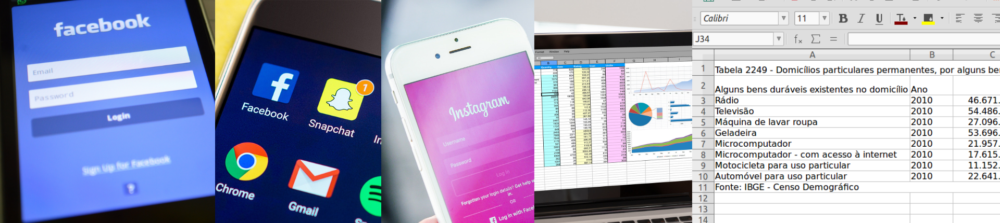
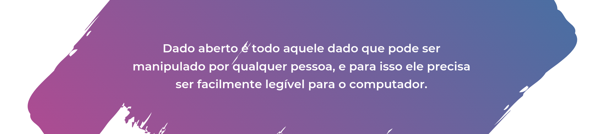
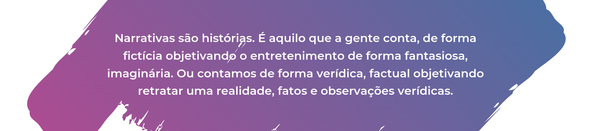

# Trilha 02 - Transformando Dados em Ferramentas

## Dados, Narrativas e Contranarrativas e um liquidificador

Dados são pequenas observações sobre um determinado contexto. 
Podem ser públicos, privados, abertos ou não.

 

Nome, Nome de usuário, Site, Biografia, Email, Telefone, Quantas geladeiras você tem em casa. Tudo isso são dados, pequenas observações sobre nós mesmos, que nós fornecemos quando fazemos o cadastro em uma rede social, como o Twitter ou Instagram, ou quando respondemos ao Censo Demográfico do IBGE.

Dependendo da política de privacidade e das configurações que o usuário faça, alguns desses dados serão privados e só estarão disponíveis para o próprio usuário e a empresa responsável pela rede social (ou pelo menos deveria ser assim né!?), e outros estarão visíveis para todas as outras pessoas que usam a rede ou não, como o seu nome de usuário ou foto de perfil.

Existem também aqueles dados que são públicos no contexto de população de um país, como são os dados do IBGE no cenário brasileiro e também de muitos órgãos governamentais que vêm aderindo a publicização de seus dados. Esses são dados de muita valia quando queremos saber mais sobre nós enquanto sociedade. E é aí que entra o que chamamos de dados abertos ou não.

 

No caso, quando os órgãos dispõem os dados em formato CSV (Comma Separated Values ou Valores Separados por Vígula) - [Veja aqui sobre a diferença entre CSV e Excel](https://www.tudoexcel.com.br/planilhas/diferenca-entre-excel-e-csv-2997.html) - , é um exemplo de dados em formato aberto, visto que é muito fácil manipular dados assim. Porém se esse órgão dispõem apenas de imagens de planilhas ou arquivos pdf, por exemplo, isso dificulta o processo de ler e processar aqueles dados, tornando aquilo um dado não aberto, mas ainda assim um dado público. Acesse a [cartilha sobre dados abertos](http://dados.gov.br/pagina/cartilha-publicacao-dados-abertos) e saiba mais sobre isso.

O http://dados.gov.br/ é um grande portal brasileiro de dados públicos e abertos. Outras fontes interessantes são:

> - [SIDRA - IBGE](https://sidra.ibge.gov.br/home/pimpfrg/nordeste)
> - [Brasil IO](https://brasil.io/home)
> - [Microdados do INEP - Dados sobre o Enem, Censo escolar, Enade e muitos outros <3](http://inep.gov.br/dados)
> - [API Dados Abertos da Câmara dos Deputados](https://dadosabertos.camara.leg.br/swagger/api.html) 
> - [IPEA - Instituto de Pesquisa Econômica Aplicada](http://www.ipeadata.gov.br/Default.aspx)
> - [IPEA - Atlas da Violência - Homicídios Faixa Etária de 15 - 29 anos - Mulheres](http://www.ipea.gov.br/atlasviolencia/dados-series/74)
> - [IPEA - Atlas da Violência - Homicídios Faixa Etária de 15 - 29 anos - Homens](http://www.ipea.gov.br/atlasviolencia/dados-series/71)
> - [Expectativa de Vida - Organização mundial de Saúde](http://apps.who.int/gho/data/view.main.SDG2016LEXREGv?lang=en)

E o que podemos fazer a partir disso? Saber mais sobre a nossa sociedade, sobre pautas que nos interessam, contrapor argumentos infundados ou notícias falsas, fiscalizar o poder público, construir conhecimento cruzando esses dados com as nossas vivências. E é aí que entram as Narrativas e Contranarrativas.

 

O que não dá pra fazer é distorcer informações e querer apresentar isso a outras pessoas como sendo real. Isso é construir uma narrativa de forma ilusória, de forma falsa o que resulta nas nossas tão atuais Fake News.

Já as contranarrativas são histórias também mas com um objetivo específico de contrapor um narrativa já conhecida, de adicionar um novo ponto de vista sobre um assunto de forma a desconstruir um conceito ou preconceito anterior. Um exemplo disso são as crescentes contranarrativas sobre como mulheres podem desenvolver suas carreiras profissionais e ocupar postos de trabalhos diversos, assunto que infelizmente ainda hoje é abordado com discriminação coibindo mulheres a terem obrigações exclusiva ou prioritáriamente com a casa e a família.

O Saferlab construiu um [super guia](http://saferlab.org.br/guia.pdf) abordando o assunto e explicando os caminhos para o desenvolvimento dessa ferramenta tão importante na luta contra a discriminação, online e offline. Conforme o guia alguns tipos de contranarrativas são:

> - Contranarrativas com dados e informações
> - Contranarrativas de pessoas e projetos inspiradores
> - Contranarrativas com testemunhos
> - Contranarrativas abordadas com humor
> - Contranarrativas com conversas
> - Contranarrativas de respostas diretas (Nosso famoso textão!)
> - Contranarrativas com analogias
> - Contranarrativas invertendo a lógica

Um dos exemplos presente no guia do Saferlab é a subversão feita com a hashtag #Écoisadepreto que converteu uma frase inicialmente falada com intuito racista em uma campanha enaltecendo realizações de pessoas negras. Acesse [Tool Box Crie Sua Contranarritiva!](http://saferlab.org.br/guia.pdf) E veja outros exemplos e dicas.

## Vamos fazer!?

Já sabemos o que são dados, narrativas, contranarrativas e de onde tirar dados. Agora nós vamos para a parte prática fazendo uma introdução das ferramentas e conceitos que vamos utilizar para constuir uma contranarrativa com dados e informações:

[Github](https://github.com/) — É uma ferramenta que as pessoas utilizam para publicar, compartilhar e versionar arquivos, como textos e códigos. O Github se utiliza do Git para permitir o versionamento de arquivos. É esse versionamento que permite que a gente dê ctrl+z nos projetos, sistemas, textos… Louvado Seja!

[Python](https://python.org.br/introducao/) — É uma linguagem de programação que tem em seus princípios a legibilidade e permite fazer uma série de tarefas de forma bem simples.

[Pandas](https://medium.com/data-hackers/uma-introdu%C3%A7%C3%A3o-simples-ao-pandas-1e15eea37fa1) — É uma biblioteca desenvolvida para Python que permite importar e manipular dados de forma muito simples.

Biblioteca — É um conjunto de algoritmos que alguem ecapsulou em um único lugar. De forma que outras pessoas possam reutilizar o código.

[Colab Google](https://colab.research.google.com) — É uma ferramente da Google que permite escrever e executar códigos daí mesmo do seu navegador. É ele que vamos usar aqui para tornar a nossa prática mais fácil.

[Jupyter Notebook](https://dadosedecisoes.com.br/o-jupyter-notebook-o-que-e/) — Ferramenta que permite a visualização e execução de código e texto. É o formato que vamos usar para explorar e descrever tudo o que vamos fazendo com os dados passo a passo.

## Mudando o ambiente

Vamos trabalhar explorando o assunto Educação Básica no Brasil e para isso vamos mudar um pouco o ambiente, 
você vai acessar o link do Colab e vai importar o nosso Notebook:

Notebook sobre Educação Básica: https://github.com/DeixeViver/eko-dados/blob/master/notebooks/explorando_educacao_basica.ipynb

Nos vídeos abaixo a gente faz uma introdução de como você pode utilizar o Colab. Segue a trilha que vai dar certo! 

<iframe width="600" height="400" src="https://www.youtube.com/embed/yEYYBCU3JXs" frameborder="0" allow="accelerometer; autoplay; encrypted-media; gyroscope; picture-in-picture" allowfullscreen></iframe>

<iframe width="600" height="400" src="https://www.youtube.com/embed/mcyj_a0bLoQ"" frameborder="0" allow="accelerometer; autoplay; encrypted-media; gyroscope; picture-in-picture" allowfullscreen></iframe>

<iframe width="600" height="400" src="https://www.youtube.com/embed/kqrwcFl4jjE" frameborder="0" allow="accelerometer; autoplay; encrypted-media; gyroscope; picture-in-picture" allowfullscreen></iframe>

> E aí, qual narrativa com dados você vai construir hoje!?

## Extra

Essa uma playlist incrivel do Énois Agência de Jornalimo que explica conceitos bacanas sobre como fazer um documentário, mas nós recomendamos para todo mundo que está produzindo conteúdo pensando em narrativas tanto textuais como vídeos. Vale o embasamento :)

<iframe width="600" height="400" src="https://www.youtube.com/embed/UfvBU7iWmdY?list=PLhkWZx0gxkbjwvnJAn0CpoIWW9GwKtCIL" frameborder="0" allow="accelerometer; autoplay; encrypted-media; gyroscope; picture-in-picture" allowfullscreen></iframe>

## Referências:

- [O que são Dados Abertos](http://dados.gov.br/pagina/dados-abertos)
- [Sobre o dados.gov.br](http://dados.gov.br/pagina/sobre)
- [Entrevista: Mulheres e o mercado de trabalho](https://www.fiesp.com.br/indices-pesquisas-e-publicacoes/entrevista-ana-paula-morgado/)
- [Mulher ainda enfrenta discriminação no mercado de trabalho](https://trt-3.jusbrasil.com.br/noticias/2608054/mulher-ainda-enfrenta-discriminacao-no-mercado-de-trabalho)

## Para saber mais:

- [Repositório com as análise de Dados do Estadão no GitHub](https://github.com/estadao)
- [Escola de Dados](https://escoladedados.org/)
- [Ferramentas simples e gratuitas de raspagem](https://escoladedados.org/tutoriais/ferramentas-simples-e-gratuitas-de-raspagem/)
- [6 ferramentas para extrair dados da Internet — avaliadas pelo Volt](https://medium.com/volt-data-lab/6-ferramentas-para-extrair-dados-da-internet-avaliadas-pelo-volt-586b6352fdd2)
- [Python para Zumbis com Fernando Masanori](https://www.pycursos.com/python-para-zumbis/)
- [Solicitando dados via Lei de Acesso à Informação](https://escoladedados.org/tutoriais/solicitando-dados-via-lei-de-acesso-a-informacao/)
- [Tudo que você queria saber sobre Git e GitHub, mas tinha vergonha de perguntar](https://tableless.com.br/tudo-que-voce-queria-saber-sobre-git-e-github-mas-tinha-vergonha-de-perguntar/)
- [Compartilhe tabelas no Google Sheets](https://escoladedados.org/tutoriais/compartilhe-tabelas-no-google-sheets/)