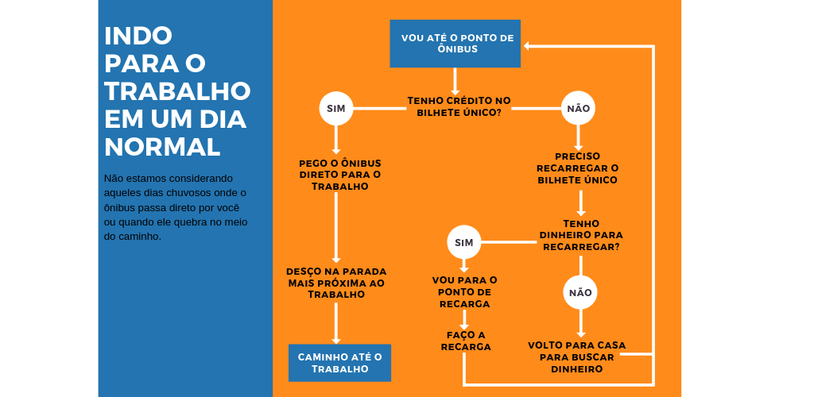

## Primeiro de tudo: O que são algoritmos?

Algoritmos são uma série de instruções para alcançar um objetivo. Simples, fácil e prático assim!

Se pensarmos no que fazemos diariamente, vamos perceber que seguimos uma série de passos a fim de completar pequenas atividades ao longo do dia. E esse é um ótimo exemplo do que são algoritmos. 
Pensa aqui comigo: **O que você precisa fazer para chegar no trabalho pela manhã?**

 

A verdade é que nós estamos acostumados a seguir algoritmos todos os dias, só que quando falamos de computadores e tecnologia da informação eles são construídos em um formato diferente e bem mais rígido do que o nosso fluxograma para chegar ao trabalho.

Beleza! Agora que já sabemos o que são algoritmos por definição e já conseguimos pensar em exemplos reais na nossa vida, vamos entender como exatamente isso acontece na Internet.

## O que os algoritmos fazem na Internet?
TUDO! T-U-D-O!

Os algoritmos na Internet, principalmente nas redes sociais, trabalham basicamente para nos fornecer acesso, fazendo nossa autenticação, organizando o que vemos no feed de notícias e nos possibilitando a interação com outras pessoas através de curtidas, comentários, postagens…

Muitas vezes eles precisam de dados de entrada, no caso, para fazer login em redes como Twitter, Instagram e Facebook você precisa informar o seu nome de usuário e a sua senha para que o algoritmo de autenticação seja capaz de verificar se você é mesmo a pessoa dona daquele perfil.

A partir do momento que você entra na rede social tudo aquilo que você faz é vinculado a sua conta. As curtidas, os stories, as fotos postadas, os comentários… tudo.

E é assim, através desses novos dados, que um outro algoritmo vai aprendendo as suas preferências na rede. Ele presume pelas suas curtidas e buscas quais são as postagens que você quer ver e organiza o seu feed a partir disso, e é nesse momento que vai sendo construída a sua bolha social.

Só que estar cercado de postagens que satisfazem a nossa bolha social nos leva a uma
experiência que exclui as opiniões divergentes da nossa e isso pode passar a sensação de que estamos sempre certos e que só existe uma única forma de enxergar o mundo.

Nessa situação vamos ver que na nossa bolha será inadmissível fazer piada com a orientação sexual das pessoas, mas na bolha daquele nosso tio o preconceito e o machismo correm soltos. Ou seja, em uma mesma rede social existem públicos separados em grupos, e esses grupos possuem visões de mundo e opiniões, por vezes, extremamente diferentes e incapazes de dialogar entre si.

E à medida que esse cenário se aprofunda na intolerância se torna um ambiente favorável para comportamentos cada vez mais ofensivos chegando ao que chamamos de discurso de ódio.

## Discurso de Ódio Online

Discurso de Ódio (DO) é o discurso que visa desqualificar e inferiorizar uma pessoa ou um grupo de pessoas com base em características que as façam pertencentes a um grupo social como etnia, gênero, condição social, orientação sexual e religião. Incitando a exclusão, defendendo o ódio, a violência ou a discriminação daquela pessoa ou grupo.

Esse é um vídeo que exemplifica bem os problemas e desafios relacionados ao DO na Internet. Faz parte do Movimento Contra o Discurso de Ódio desenvolvido pelo Setor de Juventude do Conselho da Europa.

<iframe width="600" height="400" src="https://www.youtube.com/embed/3PzphtZC0hU" frameborder="0" allow="accelerometer; autoplay; encrypted-media; gyroscope; picture-in-picture" allowfullscreen></iframe>

Existe um grande desafio em separar DO de mensagens ofensivas direcionadas a uma pessoa em específico e que nesse caso podem ser classificadas como calúnia e difamação. <a href="http://saferlab.org.br/infografico.png" target="_blank">Existe um infográfico </a> muito didático da SaferNet sobre o assunto.

Um outro grande desafio do enfrentamento desse tipo de discurso na rede é que muitas vezes ele não é facilmente identificado diante das relações interpessoais, ironia e sarcasmo.

O discurso de ódio online, além de ofender um grupo de pessoas diretamente, age naturalizando a violência contra essas pessoas tornando-se um possível incentivo a crimes de ódio. É importante cada vez mais levantar essa discussão para que possamos entender como agir, quais são os canais oficiais para denúncia e qual é a responsabilidade das grandes empresas de tecnologia.

## Compartilhei! E agora?

Dadas as devidas definições agora é hora de pensar e repensar as nossas práticas quando estamos utilizando as redes sociais. Antes de curtir, compartilhar, responder e postar é preciso ponderar sobre algumas questões:

### 1 -  Você pode estar dando atenção ao *hater*
*Hater* é aquele perfil que faz postagens ou comentários cheios de ódio, intolerância ou discriminação.
Logo, “alimentar os haters” pode não ser uma boa estratégia visto que o objetivo desses perfis, muitas vezes, é apenas causar mal-estar e chamar atenção, sem nenhuma possibilidade real de diálogo.

### 2 - Tenham empatia com a vítima
Ao compartilhar um relato de discriminação você deve considerar também a exibição que pode gerar na vida da pessoa que sofreu o ato, pois dependendo da repercussão a vítima pode ter que reviver aquela situação e isso pode ser doloroso.

### 3 - Procure os meios oficiais de denúncia
Ao compartilhar o perfil de alguém que emitiu o DO é preciso ter cuidado pois naquele momento a pessoa está sendo exposta e isso pode trazer consequências impensáveis para a vida dela. É importante combater o DO e denunciar, mas é preciso ter cautela também e procurar os meios oficiais de fazer isso para evitar incitar qualquer tipo de comportamento agressivo.

### 4 - Cuidado com os algoritmos de recomendação e com o impulsionamento
Conforme já conversamos aqui, à medida que interagimos com determinados conteúdos, mais daquele conteúdo será divulgado para nós, e se isso acontecer via anúncio, por exemplo, é possível que os responsáveis pela divulgação estejam lucrando a cada clique no respectivo material.

## De quem é a responsabilidade?

Algoritmos são construídos por pessoas, essas pessoas trabalham em empresas e essas empresas tem seus próprios objetivos, princípios, metodologias e meta$$.

A questão é que quanto menos transparência nas tecnologias menos poder de ação nós temos sobre esse cenário e sobre como ele interfere na nossa vida. Por outro lado, quando temos mais transparência sobre os “algoritmos invisíveis” temos mais autonomia crítica para levantar questões sobre como a operação desses algoritmos pode estar corroborando para a perpetuação de práticas discriminatórias, desrespeitosas, irresponsáveis e perversas.

Precisamos de mais transparência para que com mais conhecimentos possamos debater de forma profunda os impactos de práticas e tecnologias para além da Internet. E, assim, endereçar as falhas, correções e melhorias aos respectivos responsáveis, desde a não propagação de conteúdo indevido até a garantia da diversidade nos ambientes de construção desses algoritmos.

É isso! Vamos para a próxima Trilha!

 

## Referências

- <a href="https://www.tecmundo.com.br/programacao/2082-o-que-e-algoritmo-.htm" target="_blank" title="símbolos Adinkra">O que é algoritmo?</a>
- <a href="https://brasil.elpais.com/brasil/2018/03/30/tecnologia/1522424604_741609.html" target="_blank">Na verdade, o que [...] é exatamente um algoritmo?</a>
- <a href="https://chupadados.codingrights.org/gendered-targeted-ads/" target="_blank">Você está vendo isso porque é uma... - Chupadados</a>
- <a href="http://temas.folha.uol.com.br/gps-ideologico/as-bolhas-na-rede-social/criacao-de-bolhas-no-twitter-nao-e-espontanea-diz-pesquisador.shtml" target="_blank">Criação de bolhas no Twitter não é espontânea, diz pesquisador</a>
- <a href="https://www.facebook.com/about/privacy#how-we-use-information" target="_blank">Facebook: Como usamos essas informações?</a>
- <a href="https://tarciziosilva.com.br/blog/algoritmos-de-opressao-como-mecanismos-de-busca-reforcam-o-racismo/" target="_blank">Algoritmos de Opressão: como mecanismos de busca reforçam o racismo</a>
- <a href="https://www.comunicaquemuda.com.br/dossie/intolerancia-nas-redes/" target="_blank">Intolerâncias nas redes: Um problema crescente</a>

## Para Saber Mais

- <a href="https://www.youtube.com/watch?v=ZiaOzzBWfy0" target="_blank">O que é viés de algoritmo? - Computação sem Caô</a>
- <a href="https://www.ted.com/talks/joy_buolamwini_how_i_m_fighting_bias_in_algorithms/transcript?awesm=on.ted.com_9IB1&language=pt-br" target="_blank">Joy Buolamwini - Como estou combatendo o viés algortimo?</a>
- <a href="https://www.youtube.com/watch?v=B8ofWFx525s" target="_blank">Tenha cuidado com os "filtros-bolha" online - Eli Pariser</a>
- <a href="https://www.computacaosemcao.com.br/" target="_blank">Pensamento computacional para todos</a>
- <a href="https://www.youtube.com/watch?v=uGr51yGLU8Y" target="_blank">O que são algoritmos de localização?</a>
- <a href="https://brasil.elpais.com/brasil/2018/09/21/opinion/1537557693_143615.html" target="_blank">Por que devemos nos preocupar com a influência das redes sociais nas eleições 2018?</a>
- <a href="https://www.huffpostbrasil.com/entry/facebook-ataque-nova-zelandia_br_5c8c12a2e4b03e83bdc0df2f" target="_blank">Qual a responsabilidade do Facebook na exibição ao vivo do massacre da Nova Zelândia?</a>
- <a href="http://www.odionao.com.pt/" target="_blank">Movimento Contra o Discurso de Ódio</a>
- <a href="http://indicadores.safernet.org.br/indicadores.html" target="_blank">Indicadores SaferNet - 24.201 Atendimentos e 4.059.137 Denúncias</a>
- <a href="https://www.vox.com/technology/2018/10/1/17882340/how-algorithms-control-your-life-hannah-fry" target="_blank">How algorithms are controlling your life</a>
- <a href="https://www.nytimes.com/2019/03/19/opinion/facebook-youtube-new-zealand.html" target="_blank">We’re Asking the Wrong Questions of YouTube and Facebook After New Zealand</a>
- <a href="https://futurism.com/facebook-human-algorithm-hate-speech" target="_blank">Facebook Needs Humans *And* Algorithms To Filter Hate Speech</a>
- <a href="https://www.theguardian.com/technology/2017/may/22/social-media-election-facebook-filter-bubbles" target="_blank">How social media filter bubbles and algorithms influence the election</a>