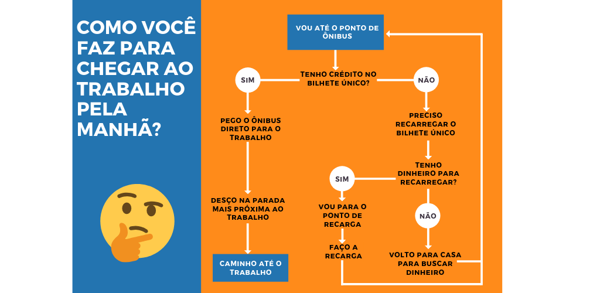

## O que são Algoritmos?

São uma série de instruções para alcançar um objetivo.
Simples, fácil e prático assim!

Se pensarmos no que fazemos diariamente, seguimos uma série de passos a fim de completar pequenas atividades ao longo do dia. O que quer dizer que basicamente seguimos vários algoritmos projetados pela nossa linda cabeça o dia todo, com base nas experiência que tivemos.
Não acredita? Pensa aqui comigo…

 

No algoritmo acima estamos considerando que você depende de transporte público e que está em um dia feliz. Agora, continuando o exercício, o que a sua experiência lhe diz sobre o mesmo passo a passo que fizemos só que considerando aqueles dias chuvosos onde o ônibus passa direto por você, quando ele quebra no meio do caminho, ou quando você descobre que tem um total de 0 reais bem na hora de passar pela catraca? 

Com certeza isso mudaria bastante o nosso roteiro, você poderia ter que fazer um caminho alternativo, ou ir até o ponto de táxi mais próximo. Enfim, acho que você já entendeu a ideia. 

A verdade é que nós estamos acostumados a seguir algoritmos todos os dias, só que quando falamos de computação eles são construídos em um formato diferente e mais rígido do que a nossa imagem acima.

Algoritmos também são chamados de Códigos, Programas, Programas de computador e Scripts. E são formados basicamente de Variáveis e Métodos. Onde Variáveis são dados necessários para seguir os passos especificados para atingir o objetivo do algoritmo, como saber a linha do ônibus de que você espera. E os Métodos são as ações, os passos propriamente ditos, como “pegar o ônibus direto para o trabalho”.

Beleza! Agora que já sabermos o que são algoritmos por definição e já conseguimos pensar em exemplos reais na nossa vida, vamos entender como exatamente isso acontece na Internet.

## O que os algoritmos fazem na Internet?
TUDO! T-U-D-O!

Na verdade eles estão por trás de muitas coisas na nossa vida, todos os nossos aparelhos eletrônicos, aplicativos, sites que usamos, portas automáticas do shopping, leitor de cartão de crédito, tudo isso só é possível através da execução de vários, váaaaaarios algoritmos.

Mas focando a nossa conversa naquilo que acontece na Internet: Quais redes sociais você usa? Já fez login nelas hoje? O Feed foi atualizado? Você precisou informar seu email/nome de usuário e senha novamente ou já tinha marcado a opção de “lembrar dados”?

Os algoritmos na Internet, principalmente nas redes sociais, trabalham basicamente para nos fornecer acesso, fazendo nossa autenticação, organizando o que vemos no Feed de notícias, e nos possibilitando a interação com outras pessoas, curtidas, comentários, postagens…

Muitas vezes eles precisam de dados de entrada (que serão Variáveis do algoritmo), no caso, para fazer login em redes como Twitter, Instagram e Facebook você precisa informar o seu nome de usuário e a sua senha, para que o algoritmo de autenticação seja capaz de verificar na base de dados da rede social se existe um usuário com aquele nome e se a senha informada corresponde com a verdadeira senha cadastrada pela dona ou dono daquela conta (esse procedimento é o Método de login e acontece quando você clica no botão).

A partir do momento que você entra na rede social tudo aquilo que você faz é vinculado a sua conta. As curtidas, os stories, as fotos postadas, os comentários… tudo.

E é assim, através desses dados de entrada que um outro algoritmo vai aprendendo as suas preferências na rede, com quais pessoas você mais se relaciona, quais os assuntos que você mais se importa, as postagens que você mais curte, e no fim te dá como resultado, uma rede social com conteúdo personalizado. Ele assume pelas suas curtidas quais são as postagens que você quer ver e organiza o seu Feed a partir disso, e é nesse momento que vai sendo construída a sua bolha social.

No fim, você costuma ver mais aquilo com o que você mais interage e aquilo que é direcionado, via anúncios, para “perfis” como o seu.

Tomando o Facebook como exemplo, você pode ver nesse <a href="https://www.facebook.com/about/privacy#how-we-use-information" target="_blank">link</a> o que a política da plataforma fala sobre como usa os seus dados.

## Discurso de ódio Online

Sabendo como funciona uma algoritmo agora vamos introduzir um outro conceito importante para a nossa conversa: Discurso de Ódio. Uma das principais questões quando falamos em Discurso de Ódio (DO) na Internet é sua relação com a Liberdade de Expressão.

Geralmente a primeira coisa alegada por quem emite DO é:

> “Mas isso é só a minha opinião”

> “Eu tenho direito a liberdade de expressão”

Mas o grande ponto aí é:

> **Não se pode exercer o direito à Liberdade de Expressão a custo da Dignidade da Pessoa Humana, que é um dos fundamentos da Constituição brasileira.**

Discurso de ódio é o discurso que visa desqualificar e inferiorizar uma pessoa ou um grupo de pessoas com base em características que as façam pertencentes de um grupo social como etnia, gênero, condição social, opção sexual, religião… incitando a exclusão, defendendo o ódio, violência ou a discriminação daquela pessoa ou grupo.

Esse é um vídeo que exemplifica bem os problemas e desafios relacionados ao DO na Internet. Faz parte do Movimento Contra o Discurso de Ódio desenvolvido pelo Setor de Juventude do Conselho da Europa.

<iframe width="600" height="400" src="https://www.youtube.com/embed/3PzphtZC0hU" frameborder="0" allow="accelerometer; autoplay; encrypted-media; gyroscope; picture-in-picture" allowfullscreen></iframe>

Existe um grande desafio em separar DO de mensagens ofensivas direcionadas a uma pessoa em específico e que nesse caso podem ser classificadas como calúnia e difamação. <a href="http://saferlab.org.br/infografico.png" target="_blank">Existe um infográfico </a> muito didático da SaferNet sobre o assunto.

Um outro grande desafio do enfrentamento desse tipo de discurso na rede é que muitas vezes ele não é facilmente identificado diante das relações interpessoais, ironia e sarcasmo.

O Discurso de Ódio Online além de ofender um grupo de pessoas diretamente, age naturalizando a violência contra essas pessoas tornando-se um possível incentivo a crimes de ódio. É importante cada vez mais levantar essa discussão e ter mais informações sobre isso, para que possamos entender como agir, quais são os canais oficiais para denúncia e qual a responsabilidade das detentoras das tecnologias.

## Compartilhei! E agora?
Dadas as devidas definições vamos à parte que nos cabe nesse rolê, que é pensar e repensar as nossas práticas na Rede bem como o que podemos fazer frente a qualquer tipo de discriminação online.

Pensando em como os algoritmos na Internet funcionam e no combate de DO online, quando compartilhamos um vídeo, foto, postagem que tem relação com DO ou quando respondemos diretamente uma dessas mensagens é preciso ponderar sobre algumas questões:

### 1 - Você pode estar dando atenção ao <i>Hater</i>.
E nesse caso “alimentar os haters” pode não ser uma boa estratégia visto que o objetivo dessas pessoas muitas vezes é apenas causar o mal estar e chamar atenção.

### 2 - Tenham empatia com a Vítima
Ao compartilhar um relato de discriminação você deve considerar também a exibição que pode gerar na vida da pessoa que sofreu o ato, porque dependendo da repercussão a vítima pode ter que reviver aquela situação e isso pode ser doloroso.

### 3 - Procure os meios oficiais de denúncia
Ao compartilhar o perfil de alguém que emitiu o DO é preciso ter cuidado pois naquele momento a pessoa está sendo exposta e isso pode trazer consequências impensáveis previamente para a vida dela. É importante combater o DO e denunciar mas é preciso ter cautela também procurando os meios oficiais de fazer isso, para evitar incitar qualquer tipo de comportamento agressivo ou "justiça com as próprias mãos".

### 4 - Cuidado com os algoritmos de recomendação e com o impulsionamento
Conforme já conversamos aqui, a medida que interagimos com determinados conteúdos mais daquele conteúdo será divulgado para nós, e se isso acontecer via anúncio, por exemplo, é possível que os responsáveis pela divulgação estejam lucrando a cada clique no respectivo material.

Quando os algoritmos tornam possível a ampla divulgação de conteúdos relacionados DO e extremismos acabam dando audiência para esses materiais e isso é capaz de fazer com que eles sejam alcançados por outras pessoas. Tanto pessoas contra quanto pessoas a favor do ato, o que pode vir a naturalizar e fortalecer grupos favoráveis a discriminação online.

## De quem é a responsabilidade?

Algoritmos são construídos por pessoas, essas pessoas trabalham em empresas e essas empresas tem seus próprios objetivos, princípios, metodologias e meta$$.

A questão é que quanto menos transparência nas tecnologias menos poder de ação nós temos sobre esse cenário e sobre como ele interfere na nossa vida. Do outro lado quando temos mais transparência sobre os “algoritmos invisíveis” temos mais autonomia crítica de levantar questões sobre como a operação dos mesmos pode estar corroborando para a perpetuação de práticas discriminatórias, desrespeitosas, irresponsáveis e perversas.

Precisamos de mais transparência para que cada vez com mais conhecimentos possamos debater de forma profunda os impactos das práticas automatizadas nos códigos da Internet. Endereçando as respectivas falhas, correções e melhorias aos respectivos responsáveis, desde a não propagação de conteúdo indevido até a garantia da diversidade nos ambientes de construção desses algoritmos.

É isso! Vamos para próxima Trilha!

 

## Referências

- <a href="https://www.tecmundo.com.br/programacao/2082-o-que-e-algoritmo-.htm" target="_blank" title="símbolos Adinkra">O que é algoritmo?</a>
- <a href="https://brasil.elpais.com/brasil/2018/03/30/tecnologia/1522424604_741609.html" target="_blank">Na verdade, o que [...] é exatamente um algoritmo?</a>
- <a href="https://chupadados.codingrights.org/gendered-targeted-ads/" target="_blank">Você está vendo isso porque é uma... - Chupadados</a>
- <a href="http://temas.folha.uol.com.br/gps-ideologico/as-bolhas-na-rede-social/criacao-de-bolhas-no-twitter-nao-e-espontanea-diz-pesquisador.shtml" target="_blank">Criação de bolhas no Twitter não é espontânea, diz pesquisador</a>
- <a href="https://www.facebook.com/about/privacy#how-we-use-information" target="_blank">Facebook: Como usamos essas informações?</a>
- <a href="https://tarciziosilva.com.br/blog/algoritmos-de-opressao-como-mecanismos-de-busca-reforcam-o-racismo/" target="_blank">Algoritmos de Opressão: como mecanismos de busca reforçam o racismo</a>
- <a href="https://www.comunicaquemuda.com.br/dossie/intolerancia-nas-redes/" target="_blank">Intolerâncias nas redes: Um problema crescente</a>

## Para Saber Mais

- <a href="https://www.youtube.com/watch?v=ZiaOzzBWfy0" target="_blank">O que é viés de algoritmo? - Computação sem Caô</a>
- <a href="https://www.ted.com/talks/joy_buolamwini_how_i_m_fighting_bias_in_algorithms/transcript?awesm=on.ted.com_9IB1&language=pt-br" target="_blank">Joy Buolamwini - Como estou combatendo o viés algortimo?</a>
- <a href="https://www.youtube.com/watch?v=B8ofWFx525s" target="_blank">Tenha cuidado com os "filtros-bolha" online - Eli Pariser</a>
- <a href="https://www.computacaosemcao.com.br/" target="_blank">Pensamento computacional para todos</a>
- <a href="https://www.youtube.com/watch?v=uGr51yGLU8Y" target="_blank">O que são algoritmos de localização?</a>
- <a href="https://brasil.elpais.com/brasil/2018/09/21/opinion/1537557693_143615.html" target="_blank">Por que devemos nos preocupar com a influência das redes sociais nas eleições 2018?</a>
- <a href="https://www.huffpostbrasil.com/entry/facebook-ataque-nova-zelandia_br_5c8c12a2e4b03e83bdc0df2f" target="_blank">Qual a responsabilidade do Facebook na exibição ao vivo do massacre da Nova Zelândia?</a>
- <a href="http://www.odionao.com.pt/" target="_blank">Movimento Contra o Discurso de Ódio</a>
- <a href="http://indicadores.safernet.org.br/indicadores.html" target="_blank">Indicadores SaferNet - 24.201 Atendimentos e 4.059.137 Denúncias</a>
- <a href="https://www.vox.com/technology/2018/10/1/17882340/how-algorithms-control-your-life-hannah-fry" target="_blank">How algorithms are controlling your life</a>
- <a href="https://www.nytimes.com/2019/03/19/opinion/facebook-youtube-new-zealand.html" target="_blank">We’re Asking the Wrong Questions of YouTube and Facebook After New Zealand</a>
- <a href="https://futurism.com/facebook-human-algorithm-hate-speech" target="_blank">Facebook Needs Humans *And* Algorithms To Filter Hate Speech</a>
- <a href="https://www.theguardian.com/technology/2017/may/22/social-media-election-facebook-filter-bubbles" target="_blank">How social media filter bubbles and algorithms influence the election</a>