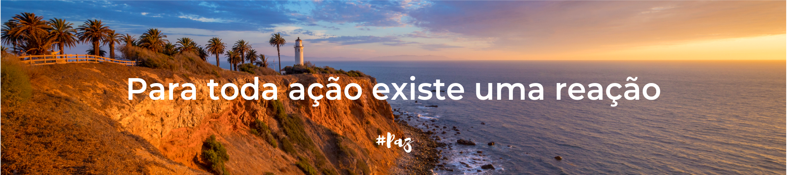

# Trilha 03 - Segurança nas Redes

## Segurança digital: Sorria, você está sendo vigiado!

A gente não vai começar esse papo falando de Internet, mas eu prometo que chego lá!

O importante aqui é te levar de volta para o ensino médio, mais especificamente para as aulas de física onde aprendemos sobre as 3 leis de newton e já que estamos na terceira trilha desse projeto, é também a terceira lei que nos interessa nesse momento:

Atenção para a foto reflexiva que pode - e deve! - ser utilizada como bom dia no grupo da família.

Mas o que isso tem a ver com segurança afinal de contas? Simples, a terceira lei de newton também pode ser aplicada no mundo virtual.
É possível rastrear TUDO, absolutamente TUDO o que você faz na Internet. Cada clique, cada site, cada visita ao perfil do ex pode ser usado contra você, pois como já dizia o pensador contemporâneo Isaac Newton: Toda ação, gera um dado sendo armazenado em algum lugar da nuvem. Nossas fontes confirmam que a frase é mesmo dele.

Estamos falando do rastro digital. Ele é composto por textos, áudio, vídeo, foto e pertencem a um determinado indivíduo. Estes rastros podem ter sido intencionalmente criados, como quando publicamos uma foto no instagram, ou um texto no facebook ou subimos um vídeo para o youtube. Mas também podem ser pegadas inconscientes como páginas acessadas, pesquisas no google, tempo de navegação, cliques num site e etc.

Um pequeno quiz para detectar os céticos a respeito do assunto, marque como verdadeiro ou falso as seguintes frases:

**[ilustrar com imagem]**
____________________________________________________________________________________________

- 1 - Eu não tenho nada a esconder
- 2 - Eu não me importo se as pessoas souberem
- 3 - Mas eu sou só mais um entre milhões, ninguém vai perder tempo me espionando
- 4 - Essas coisas só acontecem no oriente médio, não devo me preocupar
- 5 - É assim mesmo, todo mundo faz
- 6 - Mas a internet é assim mesmo

___________________________________________________________________________________________

Se você concordou com pelo menos uma dessas afirmações, temos muito o que conversar.

Privacidade nos dias de hoje é sinônimo de autonomia, poder e controle. Privacidade não é esconder-se, é ter controle sobre as informações que podem impactar diretamente o seu modo de viver no mundo real. Os lugares que você costuma frequentar, os sintomas de um mal estar que você decide pesquisar e descobre que está com câncer e tem apenas 3 dias de vida de acordo com o médico Google. As pessoas com quem você mais conversa e tantos outros exemplos que as vezes consideramos banais. Informações como essas hoje em dia são moedas de troca.

Sabe quando você vai a farmácia e pessoa no caixa te pergunta se você já possui cadastro no sistema? É rapidinho, não demora nem um minuto pra fazer, é de graça e você ainda ganha desconto no medicamento. Só vantagens! Pegadinha do malandro iê iê. O preço pago é bem alto nesse caso. Suas informações de compra são armazenadas no banco de dados da rede de farmácia que pode compartilhar a informação por exemplo com planos de saúde, e você pode ser rejeitado nos critérios da seguradora de saúde já que eles tem o seu histórico de compras. Viu só como nem tudo é tão simples?

No contexto do ativismo online a situação é ainda mais alarmante. 
As redes sociais tornaram-se um grande campo de batalha e escolher bem as suas armas inclui por exemplo um bom aplicativo de troca de mensagens, uma ótima ferramenta de busca, e criptografia de ponta.

Mas não vamos entrar em pânico, é possível limpar as suas pegadas na Internet e até mesmo vestir uma capa da invisibilidade. Segue abaixo um passo a passo do iniciante ao avançado de como manter (ao menos um pouco) a sua privacidade na rede.

### Sou iniciante no assunto, por onde começo?

*Algumas dicas simples - um pouco óbvias até - mas que não prestamos atenção porque navegar na Internet já é um processo automático. A listagem não reflete nível de importância.*

1 - Pense nas consequências das suas postagens: Esta foto pode causar eventuais problemas para a minha carreira? Essa foto fere o direito de imagem de alguém presente? Esse texto possui conteúdo considerado suspeito? Acho que vocês entenderam onde eu quero chegar.

2 - Não utilize a mesma senha para tudo: Existem diversos sites online especializados em quebra de senha - sim isso existe, mas não pesquise no google, pode te comprometer, espere até as próximas dicas - se a sua senha for única então o invasor terá acesso às suas diversas contas e consequentemente a um maior número de dados produzidos por você. “Ah, mas eu tenho memória fraca, não vou conseguir decorar tudo”. Ainda bem que já inventaram solução pra isso e não estou falando de remédio para memória. Existem diversos aplicativos e plugins cuja única finalidade é guardar senhas. Não que sejam extremamente seguros, mas a conversa aqui ainda é pra iniciante, então mesmo com a ressalva, vale a pena dar uma olhada.

3 - Não abra emails, redes sociais ou outras aplicações de caráter pessoal em qualquer lugar. A Internet é um ambiente compartilhado e não é possível saber se o computador que você está utilizando (e que não é seu) não foi infectado com algum tipo de vírus ou programa capaz de coletar tudo que é digitado no teclado por exemplo.

4 - Leia as entrelinhas. Os termos e políticas de privacidade dizem tudo o que você precisa saber sobre como as empresas pretendem utilizar as suas informações, é preciso pesar se vale mesmo a pena entregar todos os seus dados em troca de um serviço. Quando você vai a uma loja adquirir um produto você normalmente se pergunta se vale o preço, se é possível achar uma loja mais barata, se você vai realmente utilizar ou se vai ficar jogado no canto. A preocupação com os dados deve ser a mesma.

5 - Cuidado onde você clica, um clique a mais ou um clique a menos pode fazer toda diferença. Existe um termo conhecido como “fishing”, cuja tradução literal do inglês seria pescaria, nos termos da Internet é quando sites maliciosos se passam por sites conhecidos e verdadeiros para “pescar” seus dados. Uma falsificação perfeita, com todos os detalhes que você puder imaginar, uma cópia exata do site original, você clica e pronto! Era tudo de que precisavam.

6 - Seu celular é um ótimo dedo duro. Desabilite funções de comandos de voz, todo som emitido ao seu aparelho quando a função é ativada é automaticamente enviada para os servidores e armazenadas na nuvem. Nem preciso mencionar o GPS, que sabe cada passo, de cada localização em que você já esteve.

### Já passei dessa fase, acho que sei me virar
*Vou fingir que você já fez tudo que foi descrito acima e te ensinar algumas outras dicas valiosas*

1 - Dê preferência a encontros presenciais. Para além do clichê do contato humano, se a informação for realmente relevante a maior dica de segurança é a conversa ao vivo longe dos celulares, nenhuma informação é armazenada e nenhum rastro digital é criado.

2- Não consigo me encontrar pessoalmente, prefiro um aplicativo de troca de mensagens. Te entendo colega, sair de casa hoje em dia é realmente um sacrifício. Seja seletivo nas suas conversas, não faz sentido utilizar um aplicativo hiper mega seguro para perguntar se a sua avó assistiu a novela hoje. Os aplicativos mais difundidos como whatsapp, telegram e inbox apesar de não seguros não precisam ser substituídos completamente, já que oferecem algumas facilidades que outros aplicativos não possuem. Mas, caso queira, procure utilizar o Signal ou o Wire, ambos utilizam criptografia fim a fim e possuem código aberto.

**Uma pausa nas dicas para um dicionário dos termos acima que precisam ser explicados:**

> **Criptografia fim a fim:** primeiramente, o que é criptografia? De maneira bem rasa, a criptografia é um conjunto de técnicas para mascarar uma mensagem de modo que apenas quem enviou ou em quem recebeu conseguem decifra-lá. Um exemplo bem simplório, sabe quando você está numa roda de amigos, mas precisa urgente contar um babado pra amiga ou amigo sem que ninguém saiba? A frase é mais ou menos assim: “Sabe fulano? Aquele do cabelo roxo? Lembra dele? Tava ficando com aquela la que vimos na rua outro dia”. Você provavelmente não entendeu a mensagem, mas os amigos em questão sim. Esta frase está criptografada de forma que apenas os dois participantes da conversa conseguiram entender. Existem várias formas de criptografar uma mensagem, na criptografia fim a fim a mensagem é enviada criptografada e apenas no recebimento é possível descriptografar, ou seja, qualquer intervenção feita no meio da caminho para interceptar a mensagem, não vai adiantar de nada.
>
> **Código aberto:** é um termo utilizado para aplicações que tornam públicas todo o seu código fonte e os algoritmos sob o qual foram construídos. Mas porque isso é tão relevante no quesito segurança? Quando não sabemos como os algoritmos funcionam internamente, fica fácil desconfiar que existe algo ali coletando suas informações, armazenando suas mensagens ou redirecionando para outros lugares. Quando o código aberto é impossível que algo desse tipo seja feito, mais uma brilhante analogia: Imagine que o whatsapp é uma grande cozinha, sentamos, pedimos os pratos e confiamos que o que pedimos será entregue, mas não temos como ter certeza pois não temos acesso a cozinha. Agora imagine se o whatsapp tivesse o código aberto, poderíamos ir até a cozinha, olhar o chef preparando a comida, ver o agricultor plantando as verduras e eventualmente tirar alguma dúvida sobre agrotóxicos, já que toda a cadeia de produção é aberta ao público. Em qual versão do whatsapp você confia mais?
> 
> Bom, chega de parênteses, vamos voltar as dicas:

5 - Nem o windows escapou do nosso pente fino de segurança. Isso mesmo, a microsoft após todos esses anos de mercado, ainda não conseguiu garantir um software que seja seguro de ataque de hackers ou programas maliciosos.Volta e meia a empresa disponibiliza uma atualização nova para corrigir falhas na segurança. Um grande concorrente neste caso é o Linux que além de gratuito possui código aberto, cujas vantagens já foram listadas.

### Segurança levada a um outro nível
*Se você chegou até aqui é porque a situação está pior do que eu pensava, mas calma que eu ainda consigo te ajudar*

1 - Criptografando o celular. Hãn? Mas como assim? Isso mesmo, é possível transformar todos os dados do seu aparelho em código que somente você consegue entender. O Iphone já possui essa opção por padrão, ou seja, apenas você com a sua senha consegue ter acesso ao dados, qualquer outro indivíduo que tiver acesso ao seu aparelho sem autorização não conseguirá ter acesso ao dados. No Android já existe esta opção é facilmente habilitada, apesar de levar algumas horas.

2 - Salvando arquivos criptografados na nuvem. Apesar de acreditar que nada na nuvem é privado, guardar esses arquivos já criptografados pode dificultar a vida de quem está querendo roubar suas informações, a dica nesse caso é o File Encryptor, gratuito e utiliza a tecnologia AES-256, algoritmo militar que utiliza várias camadas de criptografia.

### E por fim...
Oriente, divulgue e explique aos amigos e parentes a importância de manter a sua privacidade online, atingir o maior número de pessoas é essencial para que algumas empresas ou organizações consigam rever suas prioridades  
